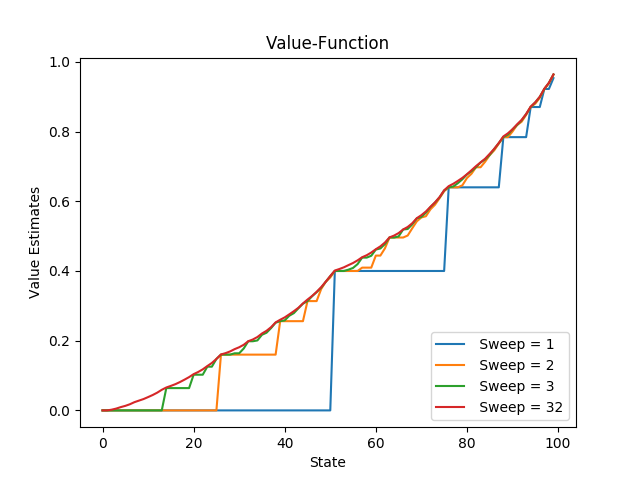
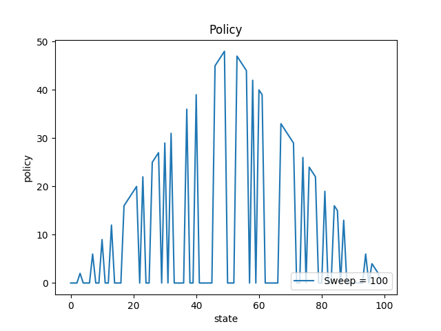

# Dynammic Programming

It is a collection of algorithms that can be used to compute optimal policies given a perfect model of the environment as a Markov decision process (MDP).We genereally assume finite MDPs for DP.For DP,One needs to know the model dynamics that is, the probability of a next state and reward given present state and actions. 
Dynammic Programming methods are important for RL beacause they give us intutions into Bellman Equations which form the core idea for RL.It consisits of Policy Iterations and Value-Iteration Methods. 
 
 
Value-Iteration is considered the most enhanced method for RL.Therefore,I have taken a problem that is solved by using Value-Iteration.

### 1.Gambler's Problem

#### Problem:
A gambler has the opportunity to make bets on the outcomes of a sequence of coin flips. If the coin comes up heads, he wins as many dollars as he has staked on that flip; if it is tails, he loses his stake. The game ends when the gambler wins by reaching his goal of $100, or loses by running out of money.On each flip, the gambler must decide what portion of his capital to stake, in integer numbers of dollars. 
Here the state-value function dhoud give us the probabilty fo winnninf from each state.I have considered the case where probabilty of coming heads is 0.4. 

run the code(as per the correct file path):
>python3 gambler\'s\ problem.py

#### Results are as follows: 

 

The left graph shows the state-value function while the right one shows the optimal policy
