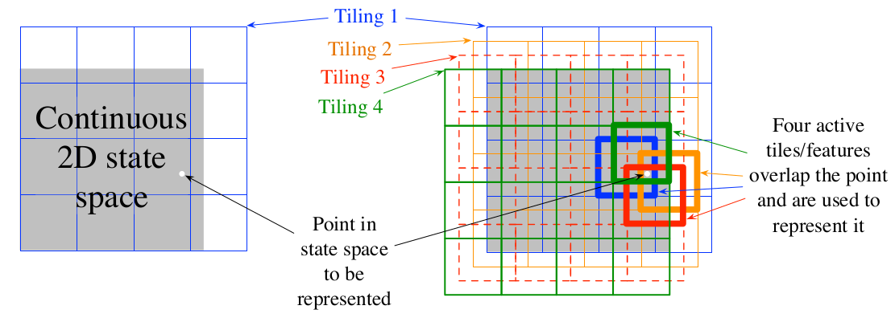
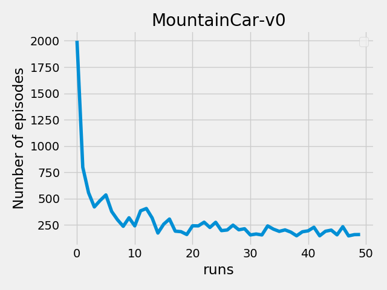

# Function Approximation

In many of the tasks to which we would like to apply reinforcement learning the state space is combinatorial and enormous;the number of possible camera images, for example, is much larger than the number of
atoms in the universe. In such cases we cannot expect to find an optimal policy or the optimal value function even in the limit of infinite time and data; our goal instead is to
find a good approximate solution using limited computational resources. Therefore,we use Function approximation methods here(Coase coading,ANNs etc.) 

### 1.Mountain-Car

In this, problem I have used Tile coading for function approximation.Tile coading is a type of Coarse coading.Tile coading makes it very easy to comput RL algos in more than one dimensional space.
The environment of this problem has been taken from Opengym-Ai,so more details can be found from there.I have used SARSA for gradient descent and updating action-values.
 

 
Above diagram showshow features are constructed using tile coading.

run the code(as per the correct file path):
>python3 mountain_car.py

#### Results are as follows: 

 
The left graph above shows the values learned after various numbers of episodes on a single run of TD(0).The right graph shows learning curves for the two methods for various values of alpha. The performance measure shown is the root mean-squared (RMS) error between the value function learned and the true valuefunction, averaged over the five states, then averaged over 100 runs.
