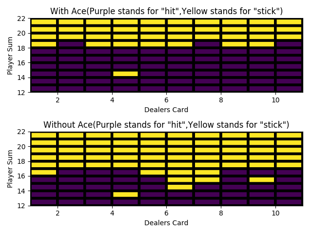
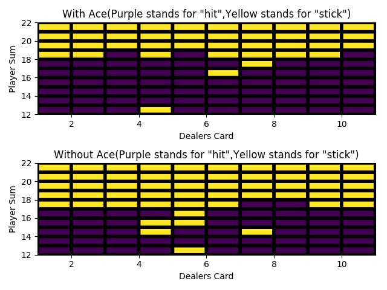
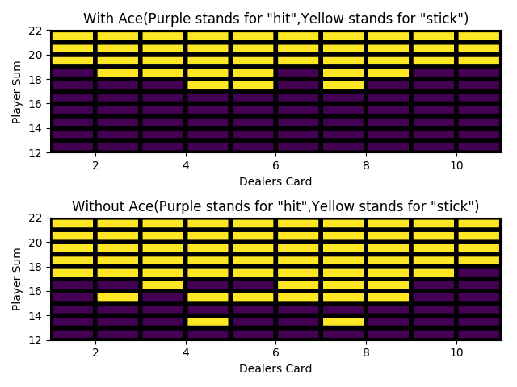

# Monte Carlo Methods

Monte Carlo methods require only experience—sample sequences of states, actions, and rewards from actual or simulated interaction with an environment.Learning from actual experience is striking because it requires no prior knowledge of the environment’s dynamics, yet can still attain optimal behavior. 
Monte-Carlo methods are a type of model-free RL methods where one finds optimal control without prior knowledge of model.Monte Carlo methods are ways of solving the RL problem based on averaging sample returns. To ensure that well-defined returns are available, here we define Monte Carlo methods only for episodic tasks.

One of the most common way to analyse Monte-Carlo methods are through a game of black-jack.I have considered two variations of Monte-Carlo.There results are as shown

### 1.Black Jack

run the code(as per the correct file path):
>python3 black_jack.py

#### Results are as follows: 

 
The graph shows the value of each state-action pair in Black-jack.The results show that where hit and stick are profitable.

### 2.Black Jack with Exploring Starts

run the code(as per the correct file path):
>python3 black_jack_es.py

#### Results are as follows: 
There are few discrepencies in the results as compared to the book results.I guess maybe its due to random behaviour , if you find out the mistake,let me know. 
I have published three results .By Analysis,the general policy is same.

