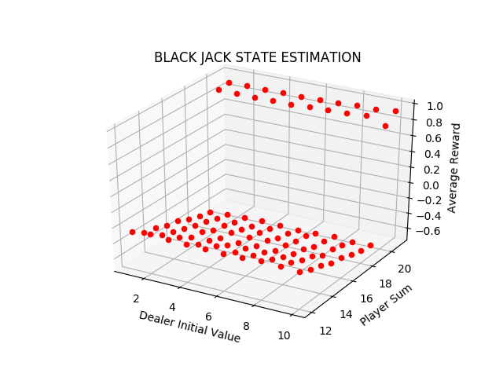

# Monte Carlo Methods

Here are test and comparison results of some simple methods used in monte carlo methods under Reinforcement Learning(RL). 

### 1.Black Jack

run the code(as per the correct file path):
>python3 black_jack.py

#### Results are as follows: 

