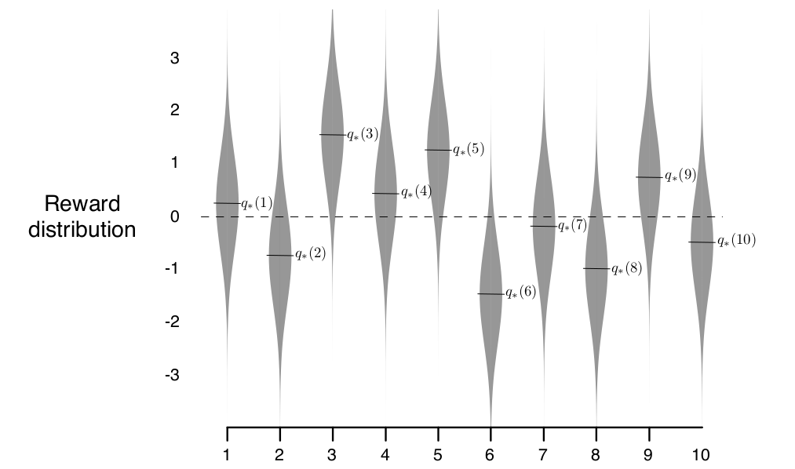
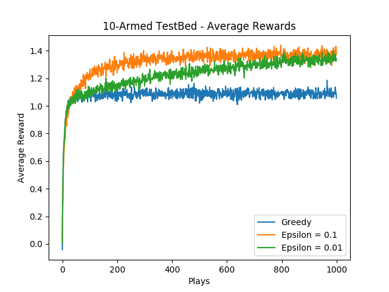
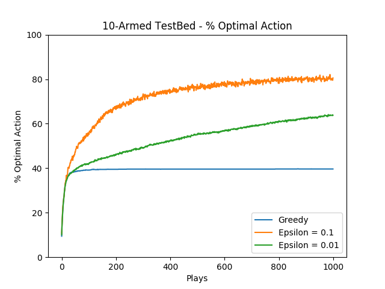
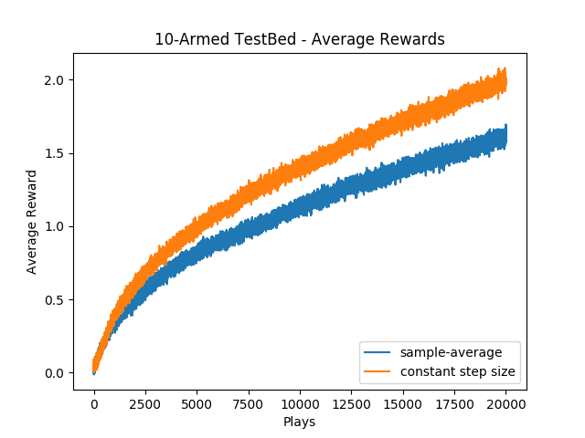
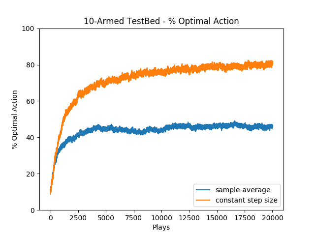
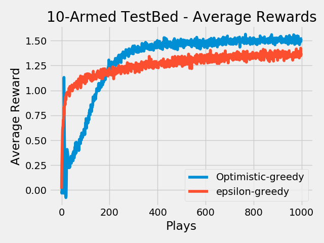
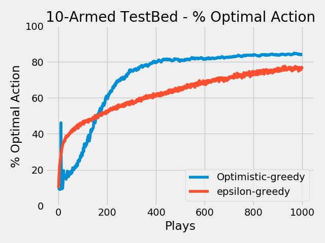
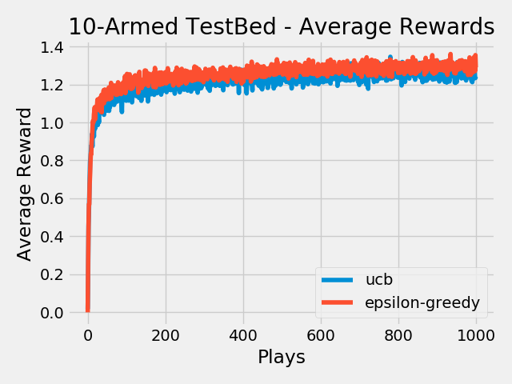
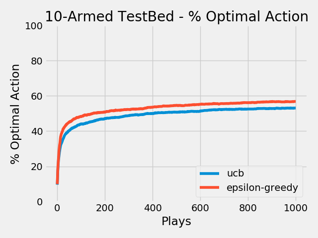

# Multi-Armed-Bandits

Multi-Armed Bandits also refered to as k-Armed Bandits is basically a problem statement.This problem forms the most basic idea of Reinforcement Learning.It states that if an agent is repeatedly face by k-different actions and each action gives a reward (reward depends on the actions),then how can the agent maximize the overall reward in a given time span(or time-steps). 

To analyse varoius solutions we have taken 10-Armed test-bed as a  sample environment, described below:

The true value q*(a) of each of the ten actions was selected according to a normal distribution with mean zero and unit
variance, and then the actual rewards were selected according to a mean q*(a) unit variance normal distribution.An example is shown in the above image.

Here are test  results of some simple methods used in Reinforcement Learning(RL).All of them have been done on ten-armed test band.For each method there have been slight variations in the way ten-armed test band has been formulated. 

### 1.Epsilon-Greedy and Greedy actions

Greedy actions mean that the agent takes that action whichever has highest Q-value,whereas the Epsion-Greedy agent takes random and greedy action based on a probabilty decided by epsilon. 

run the code(as per the correct file path):
>python3 greedy\\epsilon-greedy.py

#### Results are as follows: 

Since the Epsilon agent has the ability to explore, it eventually gets better than the Greedy agent which always follows the highest Q value action but fails to explore the better one. 
 
 
 
 

### 2.Sample-Average vs Constant-step_size

In Sample-Average method we follow the normal method of averaging the rewards to determine Q(A). In constant-step_size we use a constant step-size as parameter to update Q(a). 
Qn+1 = Qn + a[ Rn + Qn] ,where a is step-size

run the code(as per the correct file path):
>python3 Sample-avg\\constant-step_size.py

#### Results are as follows

 
 
 
 

### 3.Optimistic-greedy vs epsilon-greedy

run the code(as per the correct file path):
>python3 optimistic\\epsilon-greedy.py

#### Results are as follows

### 2.Upper Confidence Bound

run the code(as per the correct file path):
>python3 ucb.py

#### Results are as follows

