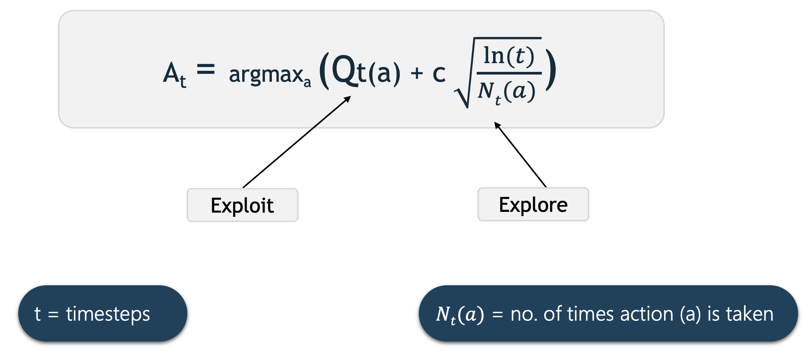

# Multi-Armed-Bandits

Multi-Armed Bandits also refered to as k-Armed Bandits is basically a problem statement.This problem forms the most basic idea of Reinforcement Learning.It states that if an agent is repeatedly face by k-different actions and each action gives a reward (reward depends on the actions),then how can the agent maximize the overall reward in a given time span(or time-steps). 

To analyse varoius solutions we have taken 10-Armed test-bed as a  sample environment, described below:

The true value q*(a) of each of the ten actions was selected according to a normal distribution with mean zero and unit
variance, and then the actual rewards were selected according to a mean q*(a) unit variance normal distribution.An example is shown in the above image.

Here are test  results of some simple methods used in Reinforcement Learning(RL).All of them have been done on ten-armed test band.For each method there have been slight variations in the way ten-armed test band has been formulated. 

### 1.Epsilon-Greedy and Greedy actions

Greedy actions mean that the agent takes that action whichever has highest Q-value,whereas the Epsion-Greedy agent takes random and greedy action based on a probabilty decided by epsilon. 

run the code(as per the correct file path):
>python3 greedy\\epsilon-greedy.py

#### Results are as follows: 

Since the Epsilon agent has the ability to explore, it eventually gets better than the Greedy agent which always follows the highest Q value action but fails to explore the better one. 
 
 
 
 

### 2.Sample-Average vs Constant-step_size

In Sample-Average method we follow the normal method of averaging the rewards to determine Q(A). In constant-step_size we use a constant step-size as parameter to update Q(a). 
Qn+1 = Qn + a[ Rn + Qn] ,where a is step-size

run the code(as per the correct file path):
>python3 Sample-avg\\constant-step_size.py

#### Results are as follows

 
 
 
 

### 3.Optimistic-greedy vs epsilon-greedy
Initial action values can also be used as a simple way to encourage exploration. Instead of setting the initial action values to zero, we set them all to +5. Recall that the q(a) in this problem are selected from a normal distribution with mean 0 and variance 1. An initial estimate of +5 is thus wildly optimistic. This optimism encourages action-value methods to explore. Whichever actions are initially selected, the reward is less than the starting estimates; the learner switches to other actions, being “disappointed” with the rewards it is receiving. The result is that all actions are tried several times before the value estimates converge. The system does a fair amount of exploration even if greedy actions are selected all the time. 

run the code(as per the correct file path):
>python3 optimistic\\epsilon-greedy.py

#### Results are as follows

 
The effect of optimistic initial action-value estimates on the 10-armed testbed.Both methods used a constant step-size parameter= 0.1.

### 2.Upper Confidence Bound

The idea of this upper confidence bound (UCB) action selection is that the square-root term is a measure of the uncertainty  in the estimate of a’s value. The quantity being maxed over is thus a sort of upper bound on the possible true value of action a, with c determining the confidence level. Each time a is selected the uncertainty is presumably reduced: Nt (a) increments, and, as it appears in the denominator, the uncertainty term decreases. On the other hand, each time an action other than a is selected, t increases but Nt (a) does not; because t appears in the numerator, the uncertainty estimate increases.
The use of the natural logarithm means that the increases get smaller over time, but are unbounded; all actions will eventually be selected, but actions with lower value estimates,or that have already been selected frequently, will be selected with decreasing frequency over time.

run the code(as per the correct file path):
>python3 ucb.py

#### Results are as follows

