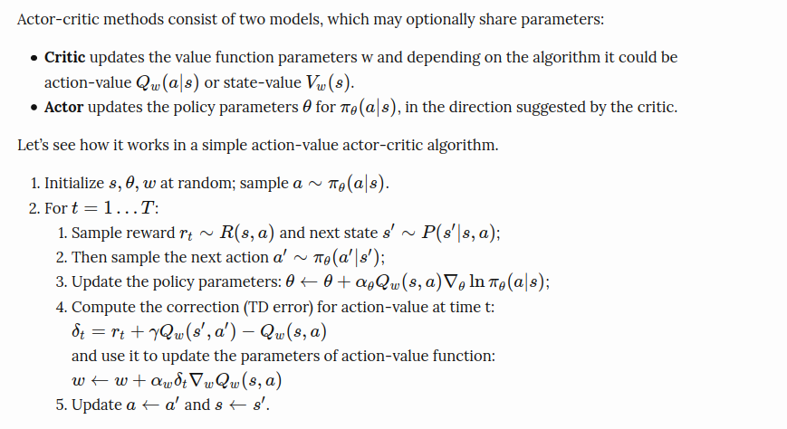

# Actor-Crtic Methods

Actor-Critic methods are improvement over the polciy gradient methods as they also learn the value-functions (Q(s,a) or V(s)) also. They cost functiin of the policy ca thus have an update through TD methods also instead of Monte-carlo as done in policy gradient. Below is the algorithm for Actor-Critc method.

</br>

</br>

Below are the programs and results of the programs in this directory.

1) Actor Crtitc in cartpole env.
```
python3 cartpole_actor_critic.py
```
