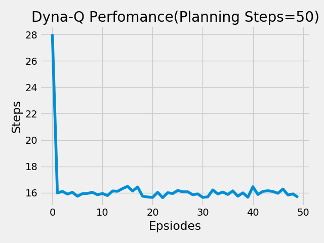

# Planning and Learning with Tabular Methods

Here are test and comparison results of some simple methods used in TD under Reinforcement Learning(RL). 

#### 1.Dyna-Maze

It is a simple gridworld problem with some non-entering states.The maze is as shown below:

#### Results are as follows: 
I have used Dyna-Q planning method to solve this maze.The algo has been used for three different planning steps(0,5,50).Below are its result.

run the code(as per the correct file path):
>python3 dyna_maze.py

###### Graph for steps-vs-episodes.

###### Final Path Followed

