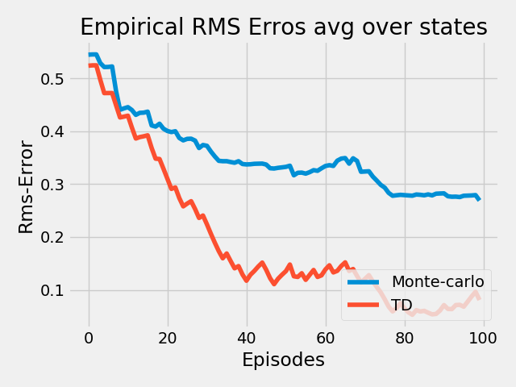
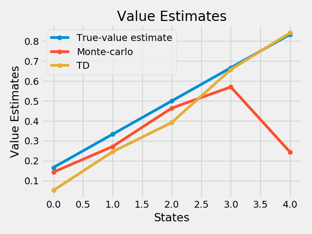

# Temporal Difference Learning

Here are test and comparison results of some simple methods used in TD under Reinforcement Learning(RL). 

### 1.Random Walk

run the code(as per the correct file path):
>python3 random_walk.py

#### Results are as follows: 

