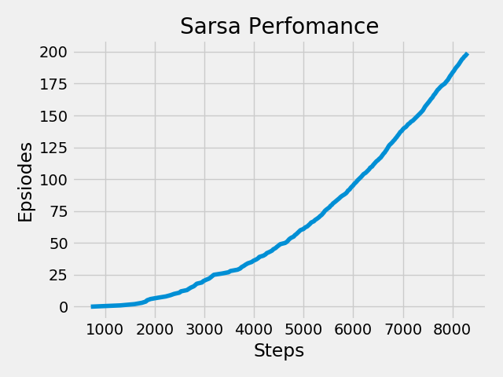
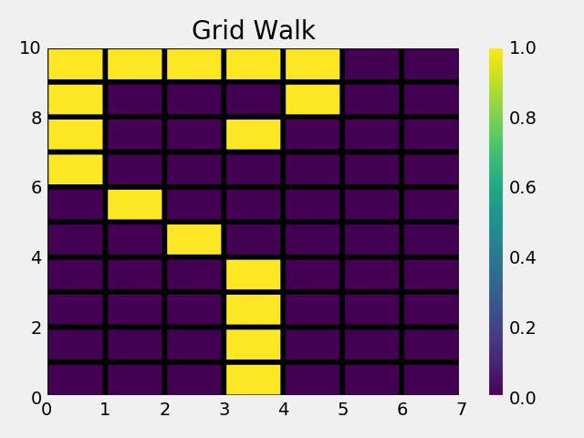

# Temporal Difference Learning

Here are test and comparison results of some simple methods used in TD under Reinforcement Learning(RL). 

### 1.Random Walk

run the code(as per the correct file path):
>python3 random_walk.py

#### Results are as follows: 

### 1.Windy GridWorld

run the code(as per the correct file path):
>python3 grid_world.py

#### Results are as follows: 

The Sarsa plot is as shown: 

The steps followed by the agent in last epsiode is as shown in the grid word.Here (0,3) is the starting position and (7,3) is goal.

