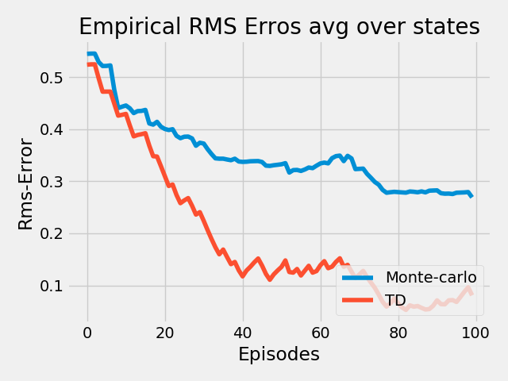
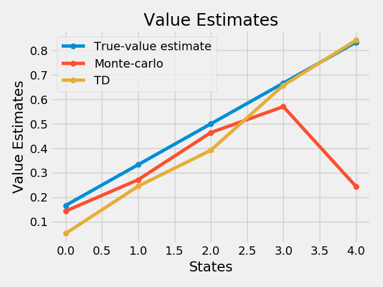
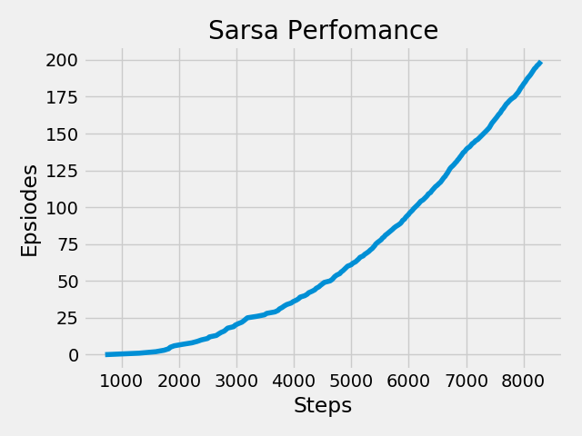
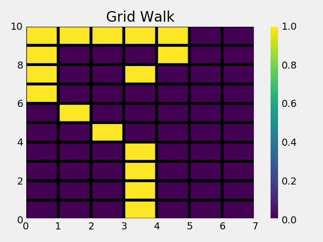

# Temporal Difference Learning

If one had to identify one idea as central and novel to RL, it would undoubtedly be temporal-difference(TD) learning. TD learning is a combination of Monte Carlo ideas and dynamic programming (DP) ideas. Like Monte Carlo methods, TD methods can learn directly from raw experience without a model of the environment’s dynamics. Like DP, TD methods update estimates based in part on other learned estimates, without waiting for a final outcome (they bootstrap).

Here are test and comparison results of some simple methods used in TD under Reinforcement Learning(RL). 

### 1.Random Walk

In this, all episodes start in the center state, C, then proceed either left or right by one state on each step, with equal probability. Episodes terminate either on the extreme left or the extreme right. When an episode terminates on the right,
a reward of +1 occurs; all other rewards are zero.Thus state-value should be equal to actual probability of reaching right end.
 
To solve this using TD methods ,I have used Tabular TD(one step)

run the code(as per the correct file path):
>python3 random_walk.py

#### Results are as follows: 

 
The left graph above shows the values learned after various numbers of episodes on a single run of TD(0).The right graph shows learning curves for the two methods for various values of alpha. The performance measure shown is the root mean-squared (RMS) error between the value function learned and the true valuefunction, averaged over the five states, then averaged over 100 runs.

### 2.Windy-Grid Problem

A standard gridworld, with start and goal states, but with one di↵erence: there is a crosswind running upward
through the middle of the grid. The actions are the standard four—up, down, right,and left—but in the middle region the resultant next states are shifted upward by a “wind,” the strength of which varies from column to column.Below is its diagram which shows the optimal path also:

 

#### Results are as follows: 

 

