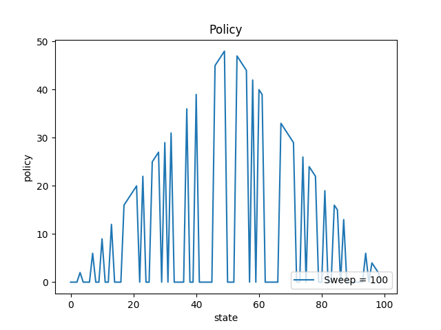

# Dynammic Programming

Here are test and comparison results of some simple methods used in dynammic programming under Reinforcement Learning(RL). 

### 1.Gambler's Problem

run the code(as per the correct file path):
>python3 gambler\'s\ problem.py

#### Results are as follows: 

